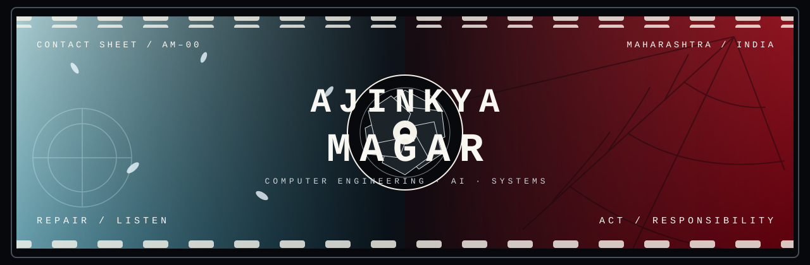
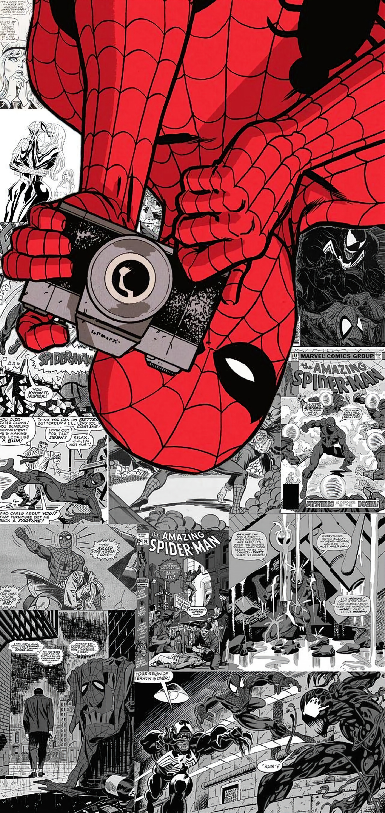

<!--
This profile is intentionally a contact sheet, not a dashboard.
No generated statistics. No streaks. No rankings. A person is not telemetry.
-->

  

  <samp>COMPUTER ENGINEERING · MAHARASHTRA, INDIA · BUILDING SYSTEMS THAT LISTEN BEFORE THEY ACT</samp>

## Two exposures. One direction.

Most profiles begin with a toolbox. Mine begins with a tension:

> **Look inward long enough to repair what is broken. Look outward far enough to act when you can help.**

I keep those as coordinates—not because I have mastered either of them, but because they point toward the person and engineer I am trying to become.

 

  

<samp>FRAME 01 / A SKY THAT FINALLY HAS PEOPLE IN IT / REPAIR</samp>

### `01 / REPAIR`

**Shoya Ishida** stays with me not because he is flawless, but because he is unfinished. His story treats becoming better as active work: listen, return, face what is difficult, and learn how to meet people instead of disappearing from them.

That translates into how I want to engineer:

- understand before automating;
- ask before assuming;
- treat failure as information, not embarrassment;
- rebuild without pretending the first version was enough.

I am interested in intelligence, but even more interested in whether that intelligence can pay attention.

---

## The person between the frames

I am **Ajinkya Magar**—AJ to people who know me—a Computer Engineering student at **MIT Academy of Engineering, Alandi**.

I work where **AI, backend systems, computer networks, and useful products** overlap. I learn by making an idea real, finding the place where reality disagrees with it, and staying for the explanation.

I do not want to merely *know technologies*. I want to know what happens after the demo: when the network is isolated, the command is ambiguous, the user is overwhelmed, the data is untidy, or the system has to earn trust.

> The polished screen is the last layer. I am usually curious about the layers that made it possible.

---

## Questions with repositories attached

Not a trophy shelf. These are questions I have tried to answer in code.

### `01` Can a computer listen without asking the human to shrink their language?

**[Synapse](https://github.com/Ajinkya00Magar/Synapse)** gives Windows hands-free voice control through English, Hindi, and Marathi. The interesting part is not the command—it is turning natural intent into a dependable action.

### `02` Can a network reveal tomorrow's failure while there is still time to respond?

**[VIKRAM](https://github.com/Ajinkya00Magar/VIKRAM)** is an air-gapped predictive copilot for secure MPLS and SD-WAN operations: local telemetry, anomaly detection, forecasting, simulation, and explanation without depending on the outside world.

### `03` Can learning feel like a place you can navigate?

**[FlowMap](https://github.com/Ajinkya00Magar/flowmap)** turns study paths, milestones, habits, and progress into an interactive learning map instead of another disconnected list of tasks.

### `04` What would campus communication look like if context were built into the system?

**[Campus Buddy](https://github.com/Ajinkya00Magar/Campus_Buddy)** brings real-time conversation, channels, notices, and role-aware access into one college space—organized around the community it actually serves.

### `05` Can software respond more carefully when words carry weight?

**[MindGuard](https://github.com/Ajinkya00Magar/mental-health-chatbot)** explores emotion detection, risk-aware responses, and mood trends as an emotional-support prototype—not as a replacement for professional care.

<a href="https://github.com/Ajinkya00Magar?tab=repositories">the rest of the contact sheet →</a>

---

## Working materials, not identity labels

**Python** when the problem needs intelligence, language, data, or a fast route from thought to experiment.

**TypeScript** when the system needs a dependable shape from interface to backend.

**C and C++** when abstraction should move aside and let me see the machine.

**Linux, Git, and computer networks** when I need to understand where software actually lives, moves, fails, and recovers.

The tool changes. The loop does not:

  <samp>NOTICE → MODEL → BUILD → BREAK → UNDERSTAND → REBUILD → SHARE</samp>

 

  

<samp>FRAME 02 / CAMERA OUT / RESPONSIBILITY</samp>

### `02 / RESPONSIBILITY`

**Peter Parker, specifically**—not the spectacle of Spider-Man. The student carrying ordinary worries, a camera, too many responsibilities, and still making the next useful choice.

That is the part I recognize: ability is not an identity by itself. What matters is where you point it. In engineering, responsibility means a feature is unfinished if it is clever but unusable, an AI system is unfinished if it cannot explain its limits, and a failure you can see becomes your next honest task.

I want to build ambitious systems without losing sight of the person waiting on the other side of them.

---

## Rules I keep in pencil

1. **Listen long enough for the real problem to replace the obvious one.**
2. **Make hidden systems legible.** Confusion grows in layers nobody can inspect.
3. **Break prototypes early and promises rarely.**
4. **Prefer useful over loud, reliable over impressive, and clear over clever.**
5. **Leave room to revise yourself.** Better code and better people both require it.

---

## If our questions overlap

Bring me a difficult system, an unfinished idea, or a problem that lives awkwardly between software and people.

  <a href="mailto:ajinkyamagarphys@gmail.com">write a letter</a>
  &nbsp;·&nbsp;
  <a href="https://www.linkedin.com/in/ajinkya-magar-6788b0251/">talk engineering</a>
  &nbsp;·&nbsp;
  <a href="https://github.com/Ajinkya00Magar?tab=repositories">read the code</a>
  &nbsp;·&nbsp;
  <a href="https://www.instagram.com/ajinkya00magar/">see outside the editor</a>

 

<samp>END OF ROLL 00 · STILL BECOMING · STILL BUILDING</samp>

This README will change when I do.

---

Visual notes: the Shoya Ishida and Spider-Man artwork were supplied for this profile. Characters and original artwork belong to their respective rights holders and appear here as personal, non-commercial visual references.
