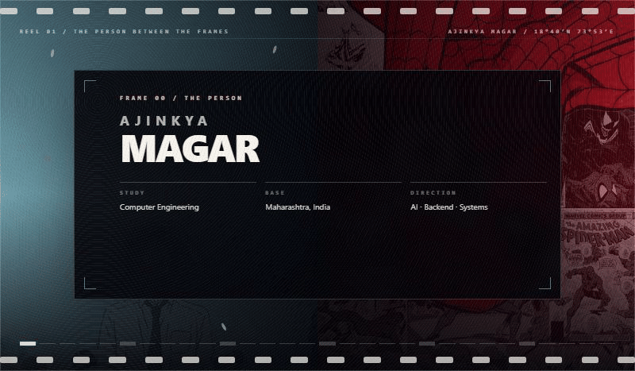
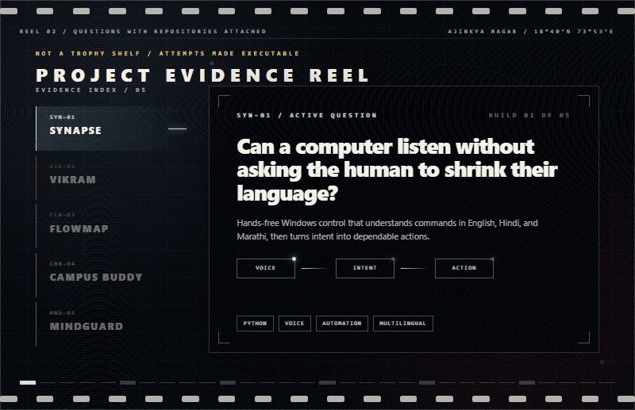
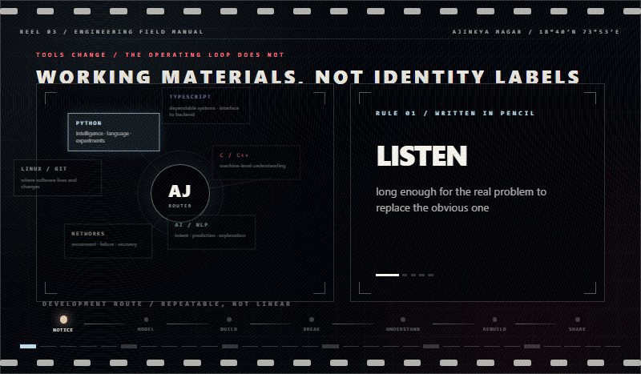

<!--
The visible profile is authored in React and rendered with Remotion.
GitHub cannot execute React in a README, so each reel is committed as an optimized looping GIF.
Editable source: ./animation
-->

  
   
  
   
  
   
  

  <a href="mailto:ajinkyamagarphys@gmail.com">write a letter</a>
  &nbsp;·&nbsp;
  <a href="https://www.linkedin.com/in/ajinkya-magar-6788b0251/">talk engineering</a>
  &nbsp;·&nbsp;
  <a href="https://github.com/Ajinkya00Magar?tab=repositories">read the code</a>
  &nbsp;·&nbsp;
  <a href="https://www.instagram.com/ajinkya00magar/">outside the editor</a>
  &nbsp;·&nbsp;
  <a href="./animation/README.md">animation source</a>

Read the profile as text · accessible / reduced-motion version

## Ajinkya Magar

Computer Engineering student at **MIT Academy of Engineering, Alandi**, based in Maharashtra, India. I work where AI, backend systems, computer networks, and useful products overlap.

My direction comes from two ideas: **look inward long enough to repair what is broken; look outward far enough to act when you can help.** Shoya Ishida represents listening, returning, and treating improvement as active work. Peter Parker—specifically the student behind the mask—represents pointing ability toward the next useful choice.

### Questions with repositories attached

- **[Synapse](https://github.com/Ajinkya00Magar/Synapse)** — multilingual, hands-free Windows control that turns spoken intent into dependable actions.
- **[VIKRAM](https://github.com/Ajinkya00Magar/VIKRAM)** — an air-gapped predictive copilot for secure MPLS and SD-WAN operations.
- **[FlowMap](https://github.com/Ajinkya00Magar/flowmap)** — an interactive learning universe connecting study paths, milestones, habits, and progress.
- **[Campus Buddy](https://github.com/Ajinkya00Magar/Campus_Buddy)** — real-time, role-aware communication designed around a college community.
- **[MindGuard](https://github.com/Ajinkya00Magar/mental-health-chatbot)** — an emotional-support prototype exploring emotion detection and risk-aware responses; not a replacement for professional care.

### Engineering field manual

I reach for **Python** for intelligence, language, data, and experiments; **TypeScript** for dependable systems from interface to backend; **C/C++** when I need to see the machine; and **Linux, Git, and networks** to understand where software lives, moves, fails, and recovers.

`NOTICE → MODEL → BUILD → BREAK → UNDERSTAND → REBUILD → SHARE`

My working rules: listen before assuming, make hidden systems legible, break prototypes early and promises rarely, prefer useful over loud, and leave room to revise.

